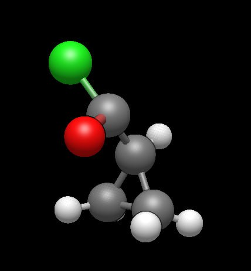
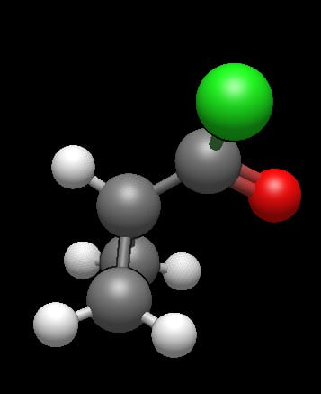
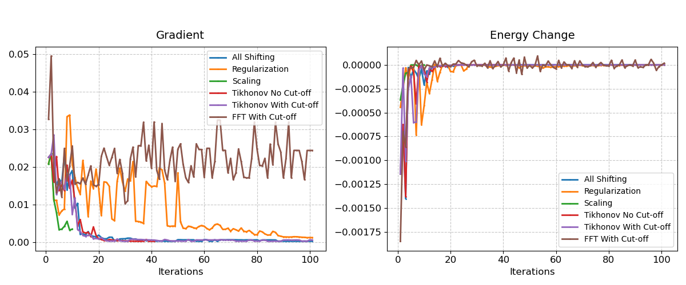
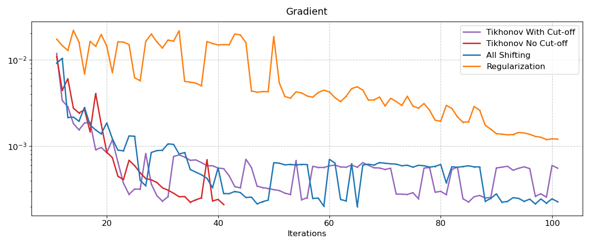

# ✨ Сшивая гиперповерхность 🧮 ✨
## 🔍 Описание проблемы 

В области вычислительной химии 🧪 часто возникает важная задача поиска собственных значений эрмитовых матриц. При этом в некоторых областях пространства волновых функций 〽️ появляются околонулевые собственные значения, которые приводят к неустойчивости метода расчета и мешают корректно находить минимум энергии системы ⚡️, поскольку приводят к большим градиентам.

Квантово-химические расчеты в данной работе (оптимизация геометрии сложной молекулы, то есть это задача минимизация функционала энергии системы в зависимости от её геометрии) проводились для молекулы циклопропанилхлорида. Валидироваться будем по значению градиента. Хотим добиться малых градиентов, чтобы сходимость метода была не только стабильной, но и быстрой.

 


## 🛠️ Реализованные методы 

В рамках проекта были реализованы следующие методы обработки матриц и собственных значений ⚙️:

- Сдвиг всех собственных значений 
```
double shift_value = 1e-5;
for(int i=0; i<n; i++) {
    S_eval[i] += shift_value; 
}
```

- Сдвиг малых собственных значений
```
double regularization_factor = 1e-5;
for(int i=0; i<n; i++) {
    if(fabs(S_eval[i]) < 1e-5) {
        S_eval[i] += regularization_factor; 
    }
}
```

- Регуляризация Тихонова 
```
double lambda = 1e-5;
for(int i=0; i<n; i++) {
    S[i*n+i] += lambda; 
}
```

- Умножение диагональных элементов на регуляризационный коэффициент (масштабирование)
```
double scaling_factor = 0.1;
for(int i=0; i<n; i++) {
    if(fabs(S_eval[i]) < 1e-5) {
        for(int j=0; j<n; j++) {
            S[i*n+j] *= scaling_factor; 
        }
    }
}
```

- FFT-фильтрация 

## 📊 Результаты 

Ниже представлены результаты применения различных методов:


*Убывание градиентов и изменений энергии*

 
*Убывание градиентов лучших методов*


Как видно из графиков, применение методов регуляризации повышает устойчивость вычислений. FFT без обрезки и масштабирование нарушали сходимость дальнейших интегралов, хотя на начальных этапах и сходились быстро. Это делает их непригодными для стабильного решения поставленной задачи. Лучшими решениями оказались регуляризации Тихонова и сдвиг СЗ.

Итогом выполнения работы стала замена SVD на Tikhonov No cut-off в данном квантово-химическом методе расчета.

Дальнейшие перспективы проекта могут заключаться в апробаже других методов или в комбинировании предыдущих методов, так например FFT с обрезкой быстро попал в область минимума и начал там скакать, на каком то этапе для увеличения скорости сходимости можно было бы заменить его на один из трех лучших методов. 

## Представленный код

В файле methods.cpp представлены все реализованные методы. В таком виде они были имплементированы в квантово-химический метод расчета (в файл matr.cpp, являющийся одним из файлов расчета). В папке test_data представлены логи квантово-химических расчетов с применением рассмотренных методов. В блокноте visualization.ipynb представлены графики, полученные по результатам парсинга этих логов.


## 📚 Список литературы 

- Glebov IO, Poddubnyy VV, Khokhlov D. Perturbation theory in the complete degenerate active space (CDAS-PT2). J Chem Phys. 2024. 161(2)
- Lloyd N. Trefethen, Bau David. Numerical Linear Algebra
- Gene H. Holub, Charles F. Van Loan. Matrix Computations
